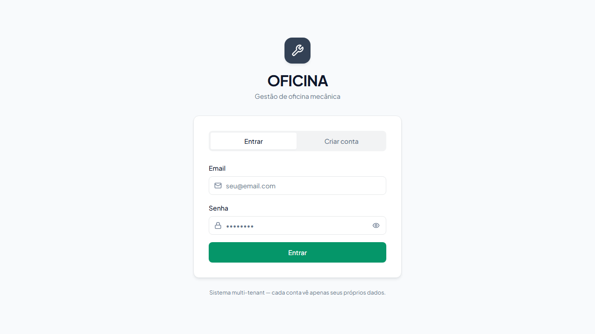

<h1 align="center">🔧 Oficina Mecânica</h1>

<p align="center">
  <b>Sistema full-stack para gestão de oficina — API serverless + interface web.</b><br/>
  <sub>Full-stack mechanic-shop management system — serverless API + web UI.</sub>
</p>

<p align="center">
  
  
  
  
  
  
  
  
  <a href="https://github.com/guuszz/OFICINA/actions/workflows/ci.yml"></a>
  <a href="https://codecov.io/gh/guuszz/OFICINA"></a>
  <a href="https://vitest.dev/"></a>
  <a href="https://oficina-swart.vercel.app"></a>
  <a href="LICENSE"></a>
</p>

<p align="center">
  <a href="https://oficina-swart.vercel.app" title="Ver demo ao vivo">
    
  </a>
</p>

<p align="center">
  <a href="https://oficina-swart.vercel.app"><b>🌐 Demo ao vivo</b></a>
</p>

---

## 💡 Sobre · About

Sistema completo para gestão de oficina mecânica: cadastro de clientes, controle de veículos, abertura e acompanhamento de ordens de serviço, autenticação, upload de foto de veículo e geração de PDF da OS.

> _Complete mechanic-shop management system: customer registration, vehicle tracking, work-order lifecycle, authentication, vehicle photo upload, and work-order PDF generation._

## ✨ Funcionalidades · Features

- 🔐 **Autenticação JWT** — cadastro, login e sessão do usuário
- 👤 **Clientes** — cadastro, listagem e busca por usuário
- 🚗 **Veículos** — vinculados a clientes, com tipo, cor e foto
- 📋 **Ordens de serviço** — abertura, atualização de status e histórico
- 🧾 **PDF da OS** — geração de documento para ordem de serviço
- 📊 **Dashboard** — métricas e visão geral da operação
- 🧪 **Testes unitários** — Vitest + Testing Library + cobertura

## 🛠️ Stack

**Backend / API**
- Vercel Serverless Functions em Node.js + TypeScript
- Prisma ORM + PostgreSQL (Neon ou outro Postgres compatível)
- JWT + bcryptjs para autenticação
- Vercel Blob para upload de fotos
- Zod para validação de entrada

**Frontend**
- React 18 + TypeScript 5.5
- Vite 5 + Tailwind CSS 3
- Componentes UI com Radix + utilitários próprios
- Lucide React para ícones

**Qualidade**
- ESLint
- Vitest + @testing-library/react
- GitHub Actions + Codecov

## 🚀 Como rodar localmente

Pré-requisitos:
- Node.js 20+
- Um banco PostgreSQL (Neon, Supabase, Docker local etc.)
- Vercel CLI se quiser rodar as functions localmente

```bash
git clone https://github.com/guuszz/OFICINA.git
cd OFICINA
npm install
cp .env.example .env
```

Preencha o `.env` com suas credenciais e rode:

```bash
npm run db:generate
npm run db:migrate

# recomendado: sobe frontend + API serverless pelo Vercel Dev
npm run dev:full
```

Acesse a URL exibida pelo Vercel CLI, normalmente <http://localhost:3000>.

Se quiser rodar somente a interface Vite, sem API serverless:

```bash
npm run dev
```

## 🔐 Variáveis de ambiente

Veja o arquivo [`.env.example`](.env.example).

| Variável | Obrigatória | Descrição |
|---|---:|---|
| `DATABASE_URL` | ✅ | String de conexão PostgreSQL usada pelo Prisma |
| `JWT_SECRET` | ✅ | Segredo longo para assinar tokens JWT |
| `BLOB_READ_WRITE_TOKEN` | ⚠️ | Token do Vercel Blob, necessário para upload/remover fotos |

## 📚 Endpoints principais

| Método | Rota | Descrição |
|---|---|---|
| POST | `/api/auth/register` | Cria conta e retorna token |
| POST | `/api/auth/login` | Autentica usuário e retorna token |
| GET | `/api/auth/me` | Retorna usuário autenticado |
| GET | `/api/clientes` | Lista clientes do usuário |
| POST | `/api/clientes` | Cadastra cliente |
| GET | `/api/veiculos` | Lista veículos do usuário |
| POST | `/api/veiculos` | Cadastra veículo |
| POST | `/api/veiculos/:id/foto` | Envia foto do veículo |
| DELETE | `/api/veiculos/:id/foto` | Remove foto do veículo |
| GET | `/api/ordens` | Lista ordens de serviço |
| POST | `/api/ordens` | Cria ordem de serviço |
| PUT | `/api/ordens/:id/status` | Atualiza status da ordem |

### Exemplo rápido

```bash
# 1) criar conta
curl -X POST http://localhost:3000/api/auth/register \
  -H "Content-Type: application/json" \
  -d '{"name":"Gustavo","email":"gustavo@email.com","password":"123456"}'

# 2) usar o token retornado para criar cliente
curl -X POST http://localhost:3000/api/clientes \
  -H "Content-Type: application/json" \
  -H "Authorization: Bearer SEU_TOKEN" \
  -d '{"nome":"João Silva","telefone":"11987654321","email":"joao@email.com"}'
```

## 📂 Estrutura

```txt
api/                    # Vercel Serverless Functions
├── _lib/               # auth, prisma e helpers compartilhados
├── auth/               # register, login, me
├── clientes/           # endpoints de clientes
├── veiculos/           # endpoints de veículos + foto
└── ordens/             # endpoints de ordens de serviço
prisma/
└── schema.prisma       # modelos User, Cliente, Veiculo e Ordem
src/                    # Frontend React
├── components/
├── contexts/
├── lib/
├── App.tsx
└── main.tsx
```

## 🧪 Testes

```bash
npm test              # roda todos os testes
npm run test:watch    # modo watch durante dev
npm run test:coverage # gera relatório de cobertura + HTML report
```

Stack de testes:
- **Vitest** — runner rápido, compatível com Jest API
- **@testing-library/react** — testa componentes pela perspectiva do usuário
- **jsdom** — DOM virtual para hooks e components
- **v8 coverage** — relatórios em `coverage/index.html`

38 testes cobrindo: `cn` helper, hooks (`useNumberTicker`, `useTheme`), e componentes (`StatusBadge`, `CarSilhouette`, `PageHeader`) — todos a 100% de cobertura nas unidades testadas.

## 🗺️ Roadmap

- [x] Persistência real (PostgreSQL via Neon + Prisma)
- [x] Autenticação JWT
- [x] Geração de PDF da OS
- [x] Testes unitários (Vitest)
- [ ] Documentação OpenAPI/Swagger
- [ ] Testes E2E (Playwright) pros CRUDs
- [ ] PWA installable
- [ ] Multi-tenant com organizações e papéis por funcionário

## 📝 Licença

MIT © [Gustavo Avelino Saraiva Oliveira](https://github.com/guuszz)
